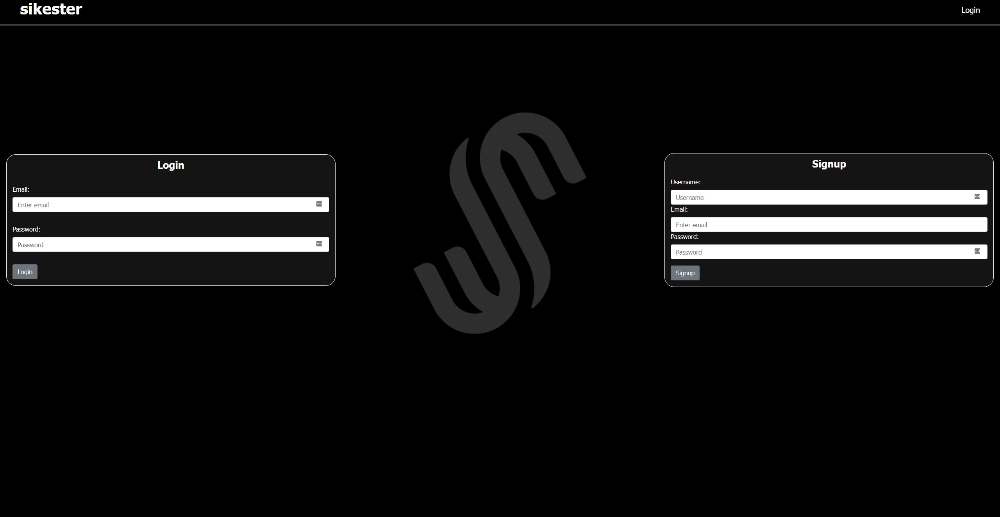

# Sikester

## Description

https://github.com/OathOfIsaac/Sikester
 
Sikester is a nostalgic internet user forum reminiscent of early 2000s IRC threads

## Table of Contents

- [Installation](#Installation)
- [Usage](#Usage)
- [License](#License)
- [Contributing](#Contributing)
- [Test](#Test)
- [Questions](#Questions)

## Installation

Here is what you need to install this application:
 
Using the Heroku link you can signup/login. Once you're logged in you can make posts, comment, and vote!

## Usage

Multiple npm packages must be installed to work on/run the app: bcrypt, connect-session-sequelize, dotenv, express, express-handlebars, express-session, moment, mysql, mysql2, sequelize, socket.io, and heroku for deployment.

## Contributing

The following users contributed to this project:
 
Isaac Gonzalez
  
Krystal Tuttle
  
Samantha Wolff
  
Enrique Jimenez
 

## Test

Here is a sample test of the application running:
 
[Heroku Link](https://desolate-basin-81470.herokuapp.com/)
 

 
## Questions

If you have any questions please reach out to me at:
 
https://github.com/OathOfIsaac
 
ejimenez2292@gmail.com
 
samanthawolff07@gmail.com 
 
Isaacfgnzlz@gmail.com
 

## License

The license used for this project is [MIT](#License).
